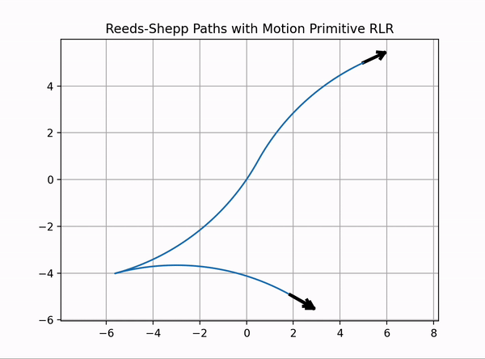
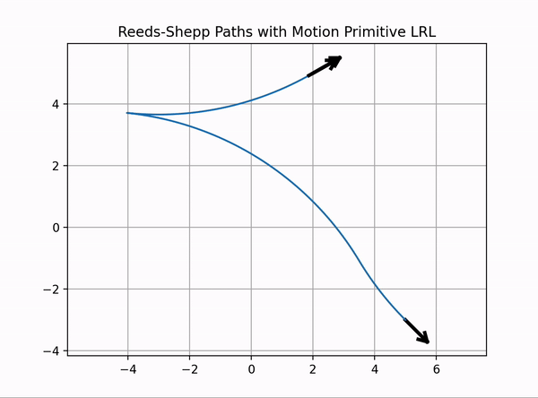

# reeds_shepp_cpp

A C++ header-only library to generate Reeds Shepp Curves for a simple kinematic car that has a fixed turning radius and can move forward and backwards.

To use the code, just add the file `reeds_shepp.hpp` to your include directtory.

<table><tr>
<td>  </td>
<td>  </td>
</tr></table>

## Usage

The Reeds-Shepp path data is contained in a `ReedsShepp::Path` data container. To get the best path between a starting pose `start_x, start_y, start_yaw` to an end goal pose `end_x, end_y, end_yaw`: 

```c++
#include "reeds_shepp.hpp"

int main() {
    ReedsShepp::Path* rs_path = ReedsShepp::reeds_shepp_path_planning(start_x, start_y, start_yaw, end_x, end_y, end_yaw, curvature, step_size);

    return 0;
}
```

The attributes that can be accessed are: 

```c++
struct Path {
    std::vector<float> lengths;  // segment lengths, negative = backwards
    std::vector<char>  ctypes;   // S: straight, L: left, R: right
    std::vector<float> x;        // x-positions
    std::vector<float> y;        // y-positions
    std::vector<float> yaw;      // orientations [rad]
    std::vector<int> directions; // 1: forward, -1: backwards
    float L;                     // total length of path 
```